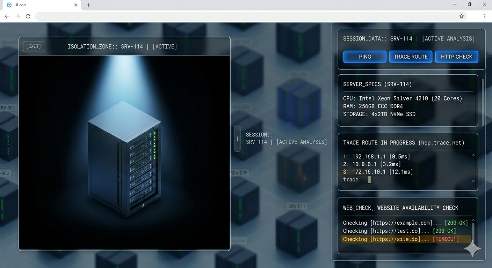

# 🌐 Isometric Server Room Explorer v5

A high-fidelity, interactive 3D Data Center Monitoring interface built with **Three.js**. This prototype features a massive isometric server grid, a "Scissor-Rendered" isolation zone for server inspection, and a functional CLI-style data panel.


*The interface in "Inspector Mode," featuring the Scissor-Rendered isolation box and CLI data panel.*

---

## 🚀 Features

* **Massive Isometric Grid:** Explore a dense array of servers with a deep perspective "down into the room" feel.
* **Procedural High-Detail Textures:** Server racks are rendered with dynamic textures, featuring horizontal hardware slots and glowing status LEDs (Green/Amber).
* **Isolation Zone (Inspector):** Click any server to enter an inspection mode. The selected server is pulled into a high-detail, brightly lit "box" on the left that fills 80% of the view.
* **Scissor Rendering:** Advanced WebGL technique allows for two independent 3D scenes to be drawn simultaneously, ensuring the spotlight in the isolation box doesn't bleed into the main server room.
* **CLI Data Panel:** A right-side symmetrical dashboard providing server specs, trace routes, and sequential website availability checks.

---

## 🛠️ Installation & Setup

Because this project uses **ES Modules** and **Three.js via CDN**, it must be run through a local web server to bypass browser security restrictions.

1.  **Prepare the Folder:** Save `index.html`, `style.css`, and `main.js` in a single directory.
2.  **Add the Preview Image:** Save your latest screenshot as `preview.png` in the same directory.
3.  **Launch a Local Server:**
    * **VS Code:** Install the [Live Server](https://marketplace.visualstudio.com/items?itemName=ritwickdey.LiveServer) extension, right-click `index.html`, and select "Open with Live Server."
    * **Python:** Run `python -m http.server 8000` in your terminal inside the folder.
    * **Node.js:** Run `npx serve`.
4.  **View the Project:** Open your browser to `http://localhost:8000`.

---

## 📁 Project Structure

```text
server-prototype/
├── index.html      # UI Layout, CLI panels, and Overlay structure
├── style.css       # Glassmorphism, Animations, and Typography
├── main.js         # Three.js Engine, Scissor Logic, and Interactivity
└── preview.png     # Visual preview for documentation